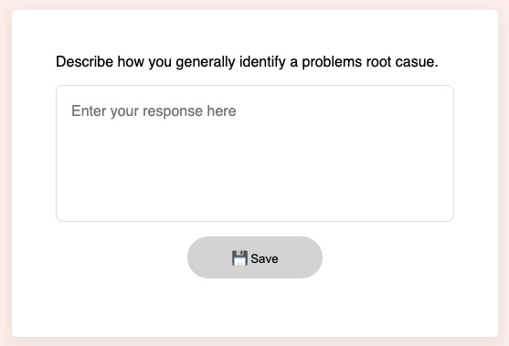

# Long text entry


This is a Scorm interaction for storing a long text entry. It stores its value in `cmi.interactions` under the specific id. It supports read and write in both Scorm 1.2 and 2004.

<small></small>

{{download::interaction}}

## example

Initialisation code used in this example:

```js
  window.riseSCORMBridgeConfig = {
    token: "{{session::token}}",
    question: "Write a essay of about 300 words on this topic.",
    mediaAbove: "https://placehold.co/300x100/orange/white/jpg/?text=The+environment.jpg",
    feedback: "✅ Thanks, i'm sure it was informative.",
    required: '100w', // 100 = 100 characters; 100w = 100 words; 100l = 100 lines;
    placeholder: "Enter your essay here. Remember to use a classic essay structure."
  }
```

How it looks:

{{embed::iframe}}

## Usage:

1. [Generate a token](/article/token) (this is used by scorm 1.2)
2. Download the zip for the interaction (use button above example)
3. Insert & modify the token initialisation code into the Custom Javascript code ([parameter reference](/articles/token/4))
4. Publish your package using Scorm & run it in a LMS

