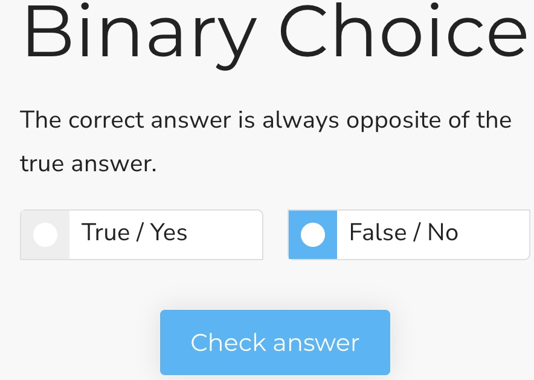

## Binary choice

This is a Scorm interaction for choosing between one of two options. It stores its value in `cmi.interactions` under the specific id. It supports read and write in both Scorm 1.2 and 2004.

<small></small>

{{download::interaction}}

## example

Initialisation code used in this example:

```js
  window.riseSCORMBridgeConfig = {
    token: "{{session::token}}",
    question: "Why is a duck?",
    mediaAbove: "https://placehold.co/300x100/orange/white/jpg/?text=file.jpg",
    feedback: {
      correct: "✅ You seem to know your taxi driver jokes",
      incorrect: "❌ What kind of excuse is that?"
    },
    distractors: {
      order: "natural",
      items: [
        { "t": {
            text: "Because one of its legs is both the same"
            }},
        { "f": {
            text: "This picture is purple and cyan"
          }
        }
      ]
    },
    correct: "t"
  }
```

How it looks:

{{embed::iframe}}

## Usage:

1. [Generate a token](/article/token) (this is used by scorm 1.2)
2. Download the zip for the interaction (use button above example)
3. Insert & modify the token initialisation code into the Custom Javascript code ([parameter reference](/articles/token/4))
4. Publish your package using Scorm & run it in a LMS


