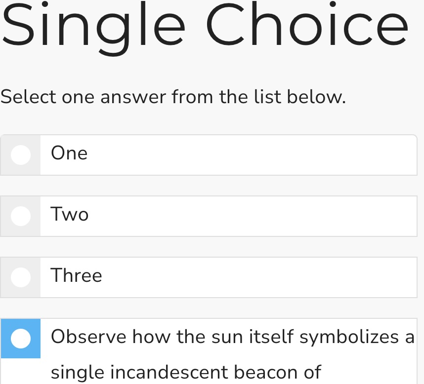

## Single choice

This is a Scorm interaction for choosing one between many possible options. It stores its value in `cmi.interactions` under the specific id. It supports read and write in both Scorm 1.2 and 2004.

<small></small>

{{download::interaction}}

## example

Initialisation code used in this example:

```js
  window.riseSCORMBridgeConfig = {
    token: "{{session::token}}",
    question: "A man, a horse and a baboon walk into a bar, and the barkeep says:",
    mediaAbove: "https://dma0ixu6zshxu.cloudfront.net/wp-content/uploads/20200422121425/assorted-wine-bottles-1283219-720x405.jpg",
    feedback: "You seem to know your taxi driver jokes",
    distractors: {
      order: "natural",
      items: [
        { "a": {
            text: "A. It's not going to be a funny joke"
            }},
        { "b": {
            text: "B. I will have heard something like it before",
            mediaBelow: "https://placehold.co/400x100/orange/white/jpg/?text=B.jpg"
            }},
        { "c": {
            text: "",
            mediaBelow: "https://placehold.co/400x100/darkgreen/white/webp/?text=C.webp"
            }},
        { "d": "D. all of the above"}, 
        { "e": "E. I refuse to take part in this fiction"}
      ]
    },
    correct: "e"
  }
```

How it looks:

{{embed::iframe}}

## Usage:

1. [Generate a token](/article/token) (this is used by scorm 1.2)
2. Download the zip for the interaction (use button above example)
3. Insert & modify the token initialisation code into the Custom Javascript code ([parameter reference](/articles/token/4))
4. Publish your package using Scorm & run it in a LMS

