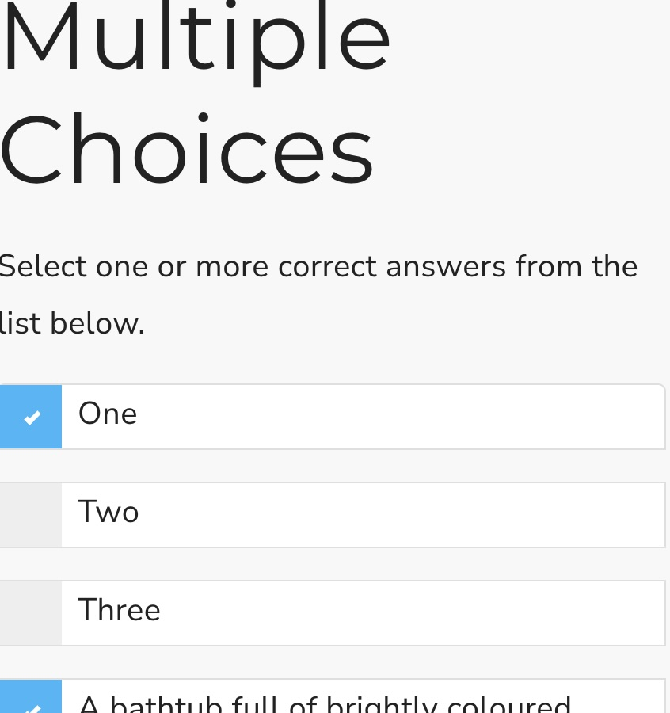

## Multiple choices

This is a Scorm interaction for choosing between one or more of many options. It stores its value in `cmi.interactions` under the specific id. It supports read and write in both Scorm 1.2 and 2004.

<small></small>

{{download::interaction}}

## example

Initialisation code used in this example:

```js
  window.riseSCORMBridgeConfig = {
    token: "{{session::token}}",
    question: "Which of these items are laws of thermodynamics:",
    mediaAbove: "https://placehold.co/400x100/skyblue/white/webp/?text=Is+it+cold+in+here?.png",
    distractors: {
      order: "random",
      items: [
        { "a": "The zeroth law of thermodynamics states that if two systems are in thermal equilibrium with a third system, they are not necessarily in equilibrium with each other."},
        { "b": "The first law of thermodynamics states that energy cannot be created or destroyed, only transformed from one form to another."},
        { "c": "The second law of thermodynamics states that entropy in an isolated system always decreases over time."},
        { "d": {
            text: "The third law of thermodynamics implies that it is impossible to reach absolute zero temperature in a finite number of steps.",
            }},
        { "e": "The laws of thermodynamics apply to everything from engines to black holes."}
      ]
    },
    correct: "b,d,e",
    feedback: {
      correct: "That is the correct answer.",
      incorrect: "Sorry"
    }
  }
```

How it looks:

{{embed::iframe}}

## Usage:

1. [Generate a token](/article/token) (this is used by scorm 1.2)
2. Download the zip for the interaction (use button above example)
3. Insert & modify the token initialisation code into the Custom Javascript code ([parameter reference](/articles/token/4))
4. Publish your package using Scorm & run it in a LMS
