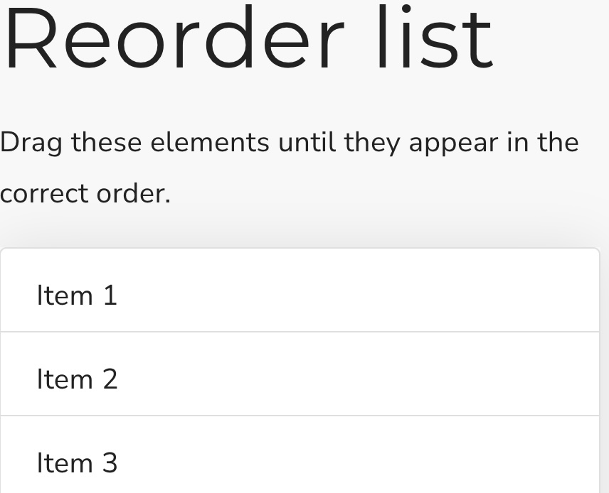

## Reorder a list

This is a Scorm sorting interaction where the user must order a list in the correct order. It stores its value in `cmi.interactions` under the specific id. It supports read and write in both Scorm 1.2 and 2004.

<small></small>

{{download::interaction}}

## example

Initialisation code used in this example:

```js
  window.riseSCORMBridgeConfig = {
    token: "da5399da5a1a97bf437b6e38dba38db5",
    question: "Drag the list below into the correct order.",
    distractors: {
      order: "random",
      items: [
        { "a": "always"},
        { "b": "bring"},
        { "c": {text:"chocolate",mediaBelow:"https://images.unsplash.com/photo-1599599810769-bcde5a160d32?w=500&auto=format&fit=crop&q=60&ixlib=rb-4.1.0&ixid=M3wxMjA3fDB8MHxzZWFyY2h8N3x8Y2hvY29sYXRlfGVufDB8fDB8fHwwz=.jpg"}},
        { "d": {text:"during"}},
        { "e": "every" },
        { "f": "fun" },
        { "g": "gathering" }
      ]
    },
    correct: "a,b,c,d,e,f,g",
    feedback: {
      correct: "✅ Behold, an alphabeticist",
      incorrect: "❌ step back and have a think; perhaps read it aloud"
    },
  }
```

How it looks:

{{embed::iframe}}

## Usage:

1. [Generate a token](/article/token) (this is used by scorm 1.2)
2. Download the zip for the interaction (use button above example)
3. Insert & modify the token initialisation code into the Custom Javascript code ([parameter reference](/articles/token/4))
4. Publish your package using Scorm & run it in a LMS


