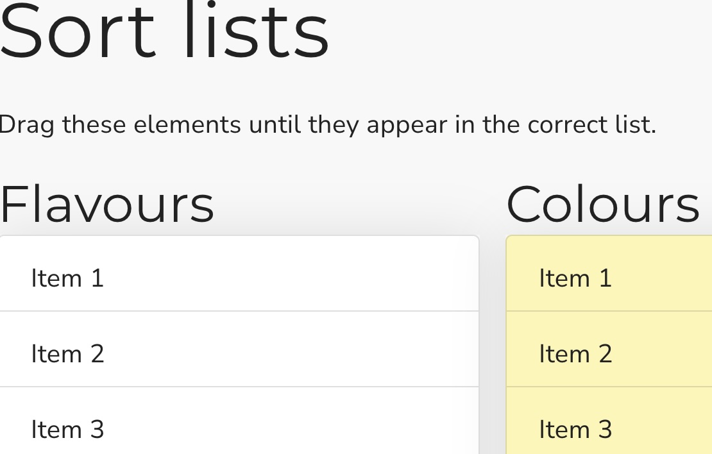

## Sort many lists

This is a Scorm sorting interaction where the user must both identify items in the correct lists, then order each list correctly. It stores its value in `cmi.interactions` under the specific id. It supports read and write in both Scorm 1.2 and 2004.

<small></small>

{{download::interaction}}

## example

Initialisation code used in this example:

```js
  window.riseSCORMBridgeConfig = {
    token: "{{session::token}}",
    question: "Drag items to their correct lists.",
    lists: [
      {
        label: "Flavours",
        items: [
          { "a": "Vanilla"},
          { "b": "Pepper"},
          { "c": "Mint"},
          { "d": "Salt"},
          { "e": "Banana" },
          { "f": "Chocolate" },
          { "g": "Caramel" }
        ]
      },
      {
        label: "Colours",
        items: [
          { "h": "Aquamarine"},
          { "i": "Goldenrod"},
          { "j": "Navy"},
          { "k": "Puce"},
          { "l": "Mauve" },
          { "m": "Ochre" }
        ]
      }
    ],
    // correct: "[a,b,c,d,e,f,g],[h,i,j,k,l,m],[n,o,p,q]" // not required; implied from setup,
    feedback: "I'm sure you gave it your best",
  }
```

How it looks:

{{embed::iframe}}

## Usage:

1. [Generate a token](/article/token) (this is used by scorm 1.2)
2. Download the zip for the interaction (use button above example)
3. Insert & modify the token initialisation code into the Custom Javascript code ([parameter reference](/articles/token/4))
4. Publish your package using Scorm & run it in a LMS

