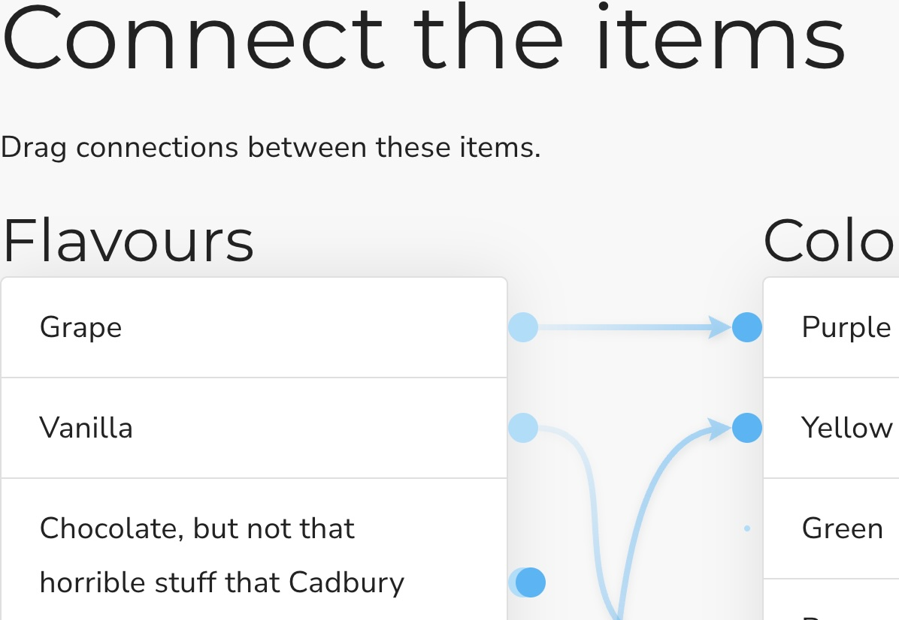

## Connect list

This is a Scorm dragging interaction where the user must match items in one list with items in another by connecting the lines. It stores its value in `cmi.interactions` under the specific id. It supports read and write in both Scorm 1.2 and 2004.

<small></small>

{{download::interaction}}

## example

Initialisation code used in this example:

```js
  window.riseSCORMBridgeConfig = {
    token: "{{session::token}}",
    question: "Connect the items from the list on the left to their counterparts on the right:",
    distractors: {
      order: "random",
      plugs: {
        label: "Source",
        items: [
          {"a": "Grape"},
          {"b": "Vanilla"},
          {"c": "Chocolate, the good kind"},
          {"d": {mediaAbove:"https://images.unsplash.com/photo-1534308983496-4fabb1a015ee?ixlib=rb-1.2.1&ixid=eyJhcHBfaWQiOjEyMDd9&auto=format&fit=crop&w=400&q=60&z=.jpg"}},
          {"e": "Lemon"},
          {"f": "Lime (Starburst flavour)"}
        ]
      },
      sockets: {
        label: "Destination",
        items: [
          {"g": "Black (raw)"},
          {"h": "Brown"},
          {"i": "Purple"},
          {"j": "Yellow"},
          {"k": {mediaBelow:"https://images.unsplash.com/photo-1527856263669-12c3a0af2aa6?ixlib=rb-1.2.1&ixid=eyJhcHBfaWQiOjEyMDd9&auto=format&fit=crop&w=400&q=60&z=.jpg"}},
          {"l": "Green"}
        ]
      }
    },
    correct: "a=i,b=g,c=h,d=k,e=j,f=l",
    feedback: {
      correct: "That is the correct answer.",
      incorrect: "Sorry you've only made spaghetti"
    }
  }
```

How it looks:

{{embed::iframe}}

## Usage:

1. [Generate a token](/article/token) (this is used by scorm 1.2)
2. Download the zip for the interaction (use button above example)
3. Insert & modify the token initialisation code into the Custom Javascript code ([parameter reference](/articles/token/4))
4. Publish your package using Scorm & run it in a LMS

