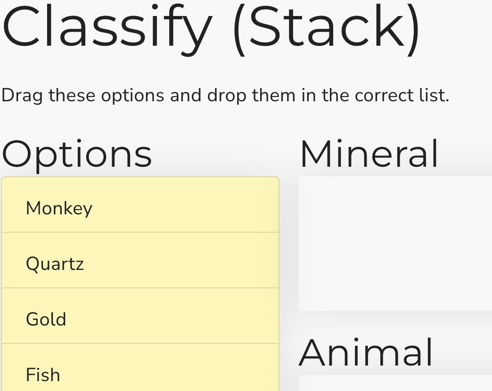

## Classify (stack)

This is a Scorm dragging interaction where the user must add each item to the correct list. It stores its value in `cmi.interactions` under the specific id. It supports read and write in both Scorm 1.2 and 2004.

<small></small>

{{download::interaction}}

## example

Initialisation code used in this example:

```js
   window.riseSCORMBridgeConfig = {
    token: "{{session::token}}",
    question: "Drag options into their correct areas.",
    label: "Things",
    lists: [
      {
        label: "Animals",
        items: [
          { "a": "Monkey"},
          { "b": "Horse"},
          { "c": "Fish"},
        ]
      },
      {
        label: "Minerals",
        items: [
          { "d": "Gold" },
          { "e": "Tin" },
          { "f": "Protactinium" }
        ]
      },
      {
        label: "Funguses",
        items: [
          { "g": "Mushroom" },
          { "h": "Toadstool" }
        ]
      }
    ],
    feedback: {
      correct: "✅ Yep.",
      incorrect: "❌ Nup."
    }
  }
```

How it looks:

{{embed::iframe}}

## Usage:

1. [Generate a token](/article/token) (this is used by scorm 1.2)
2. Download the zip for the interaction (use button above example)
3. Insert & modify the token initialisation code into the Custom Javascript code ([parameter reference](/articles/token/4))
4. Publish your package using Scorm & run it in a LMS

