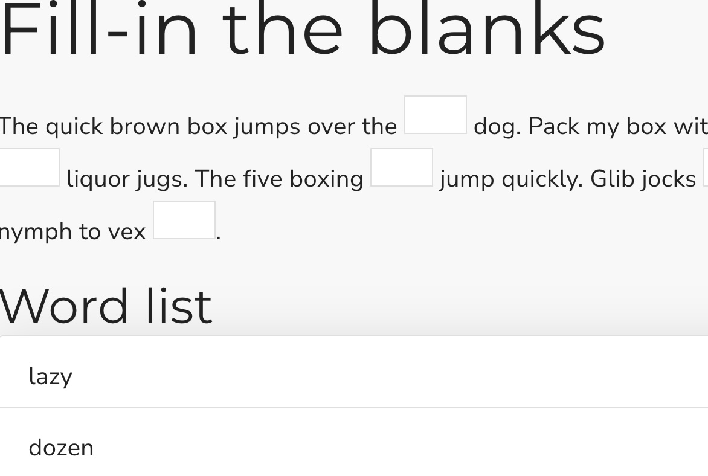

## Fill in the blanks

This is a Scorm dragging interaction where the user must complete one or more sentances using a word list. It stores its value in `cmi.interactions` under the specific id. It supports read and write in both Scorm 1.2 and 2004.

<small></small>

{{download::interaction}}

## example

Initialisation code used in this example:

```js
  window.riseSCORMBridgeConfig = {
    token: "{{session::token}}",
    question: `<em style='font-size:0.9rem;opacity:0.6'>Drag items from the <b>Word list</b> to the empty spaces. There may be more words than spaces.</em>\nThe quick brown box jumps over the ----- dog. Quidquid latine dictum sit, alrum videtur. Or "anything said in Latin sounds profound". A recent ironic Latin phrase to poke fun at people who seem to use Latin phrases and quotations only to make themselves sound more important or "educated". Similar to the less common omnia dicta fortiora si dicta Latina (Everything said is stronger if said in Latin). Pack my box with five ----- liquor jugs. The five boxing ----- jump quickly. Glib jocks ----- nymph to vex -----.`,
    distractors: {
      order: "random",
      items: [
        { "a": "lazy"},
        { "b": "jesus"},
        { "c": "dozen"},
        { "d": { mediaAbove: "https://placehold.co/100x20/?text=Wizards.png" }},
        { "e": "quiz" },
        { "f": "snails" },
        { "g": "dwarf" }
      ],
      label: "Word list"
    },
    correct: "a,c,d,e,g",
    feedback: {
      correct: "✅ We are in the presence of a true wordsmith",
      incorrect: "❌ Time to hit the books"
    },
  }
```

How it looks:

{{embed::iframe}}

## Usage:

1. [Generate a token](/article/token) (this is used by scorm 1.2)
2. Download the zip for the interaction (use button above example)
3. Insert & modify the token initialisation code into the Custom Javascript code ([parameter reference](/articles/token/4))
4. Publish your package using Scorm & run it in a LMS

