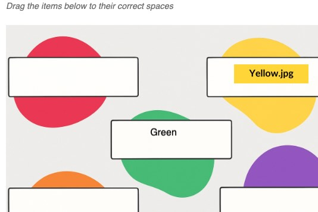

## Drag onto an image

This is a Scorm dragging interaction where the user must drag blocks of text (or images) onto drop-zones on an image. Drop-zones are defined by pixel coordinates (x,y are left and top, w,h are width and height; these become responsive when the interaction starts) If all the drops are in the right places, the answer is correct. It supports Scorm 1.2 and 2004, and no-scorm.

<small></small>

{{download::interaction}}

## example

Initialisation code used in this example:

```js
  window.riseSCORMBridgeConfig = {
    token: "da5399da5a1a97bf437b6e38dba38db5",
    question: `<em style='font-size:0.9rem;opacity:0.6'>Drag the items below to their correct spaces</em>`,
    image: 'background.png',
    distractors: {
      order: "random",
      items: [
        { "a": "Red",      target: {x:18,  y:143, w:530, h:152, css:"special"}},
        { "b": "Green",    target: {x:450, y:407, w:487, h:145}},
        { "c": { mediaAbove: "https://placehold.co/125x32/gold/black?text=Yellow.jpg" },   target: {x:851, y:144, w:551, h:149}},
        { "d": "Purple",   target: {x:911, y:686, w:522, h:148}},
        { "e": "Orange",   target: {x:20,  y:691, w:521, h:146}}
      ]
    },
    feedback: {
      correct: "✅ Well done, you know your stuff",
      incorrect: "❌ Time to hit the books"
    },
  }
```

If you are using images as your draggable items, follow the `{ mediaAbove: "https://path-to-image.jpg" }` pattern. The file path needs to end with a file extension.

How it looks:

{{embed::iframe}}

## Usage:

1. [Generate a token](/article/token) (this is used by scorm 1.2)
2. Download the zip for the interaction (use button above example)
3. Insert & modify the token initialisation code into the Custom Javascript code ([parameter reference](/articles/token/4))
4. Publish your package using Scorm & run it in a LMS

## Coordinate helper

The following helper utility can help you create the coordinates used by the `target`.

{{embed::helper}}
