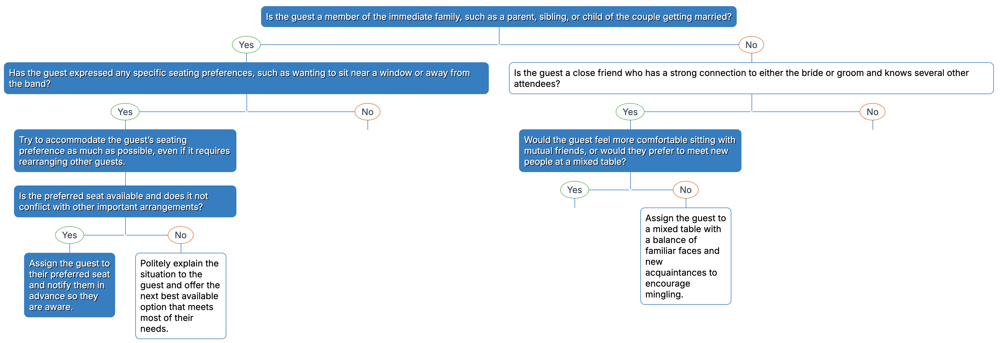

This is a balanced tree made up of binary choices - typically yes or no, but accepts any label. Boxes present dichotomies, and the user chooses a branch. Positive and Negative responses are styled differently, but the whole 'tree' balances out in the end, filling the space as best it can.



The text is based on code, so you can have as much or little as you like and don't have to rebuild the physical layout yourself. Some labels have the `|` character, which tells the renderer to draw a second box - so you can present a response, then ask a follow up. Leaf nodes are ones without choices.

## wedding seating example

The  object which makes up this example is as follows:

```js
	const obj = {
    "label": "Is the guest a member of the immediate family, such as a parent, sibling, or child of the couple getting married?",
    "choices": {
        "Yes": {
            "label": "Has the guest expressed any specific seating preferences, such as wanting to sit near a window or away from the band?",
            "choices": {
                "Yes": {
                    "label": "Try to accommodate the guest’s seating preference as much as possible, even if it requires rearranging other guests.|Is the preferred seat available and does it not conflict with other important arrangements?",
                    "choices": {
                        "Yes": {
                            "label": "Assign the guest to their preferred seat and notify them in advance so they are aware.",
                            "choices": {}
                        },
                        "No": {
                            "label": "Politely explain the situation to the guest and offer the next best available option that meets most of their needs.",
                            "choices": {}
                        }
                    }
                },
                "No": {
                    "label": "Seat the guest at the main family table, ensuring they are close to the couple and other immediate family members.",
                    "choices": {}
                }
            }
        },
        "No": {
            "label": "Is the guest a close friend who has a strong connection to either the bride or groom and knows several other attendees?",
            "choices": {
                "Yes": {
                    "label": "Would the guest feel more comfortable sitting with mutual friends, or would they prefer to meet new people at a mixed table?",
                    "choices": {
                        "Yes": {
                            "label": "Seat the guest with their group of friends, making sure the table is lively and enjoyable for everyone.",
                            "choices": {}
                        },
                        "No": {
                            "label": "Assign the guest to a mixed table with a balance of familiar faces and new acquaintances to encourage mingling.",
                            "choices": {}
                        }
                    }
                },
                "No": {
                    "label": "Is the guest a colleague from work, a distant relative, or someone who does not know many other guests at the wedding?",
                    "choices": {
                        "Yes": {
                            "label": "Place the guest at a table with other colleagues, distant relatives, or guests in a similar situation to foster conversation.",
                            "choices": {}
                        },
                        "No": {
                            "label": "Seat the guest at a general table with a diverse mix of attendees to help them feel included and welcome.",
                            "choices": {}
                        }
                    }
                }
            }
        }
    }
};
```

{{embed::example}}

You can download this example code here:

{{download::example}}

